<p align="center">
  
</p>

<h1 align="center">录阶 / LuJie CareerKit</h1>

<p align="center">
  <strong>帮助你从简历编辑到 Offer 录用的 AI 驱动求职工作台，覆盖简历编辑、JD 匹配、投递跟进、模拟面试和复盘。</strong>
</p>
<p align="center">
  <a href="README.md">English</a> · 简体中文
</p>

<p align="center">
  
  
  
  
  
  
</p>

<p align="center">
  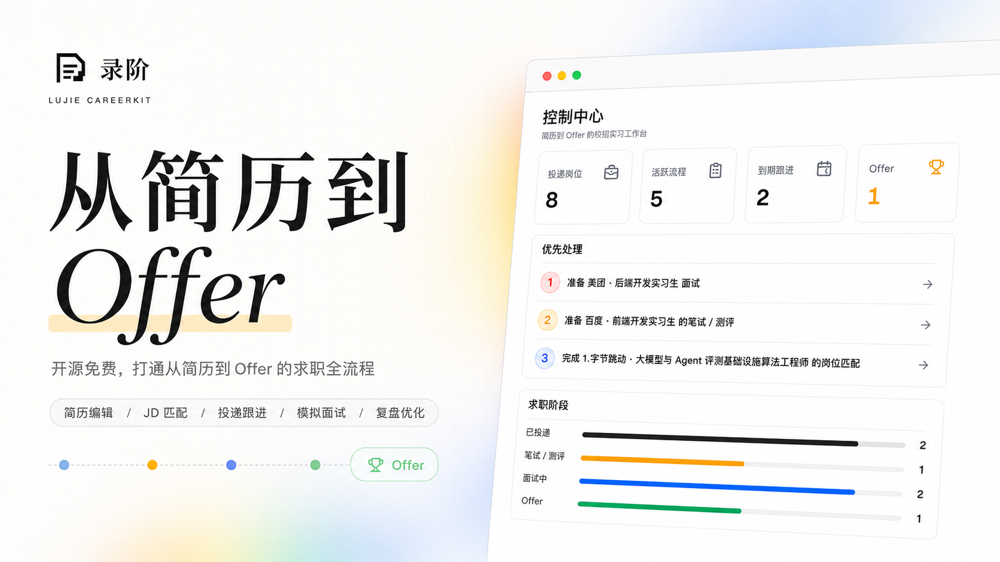
</p>

## 项目简介

录阶面向实习、校招和职业求职场景，把简历编辑、岗位匹配、投递管理、面试准备、模拟练习和 AI 复盘放在同一个 AI 驱动的求职工作台里。你可以围绕不同岗位维护多份简历版本，根据岗位描述生成更贴合岗位要求的简历表达与专属面试准备资料，记录每一次投递进展，并在面试前后持续沉淀知识、回答、反馈和复盘材料。

## 在线预览

访问 [https://lujie.chozzc.dev](https://lujie.chozzc.dev) 体验在线预览。

## 界面预览

| **控制中心** | **简历库** |
| --- | --- |
| 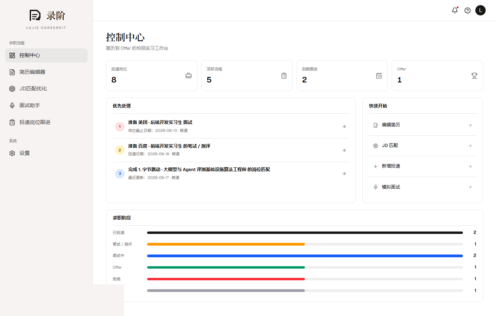 | 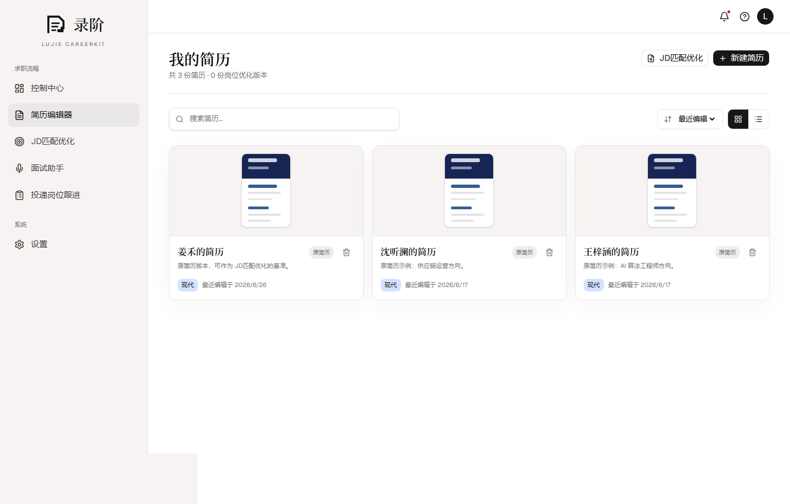 |
| **简历编辑器** | **JD 匹配优化** |
| 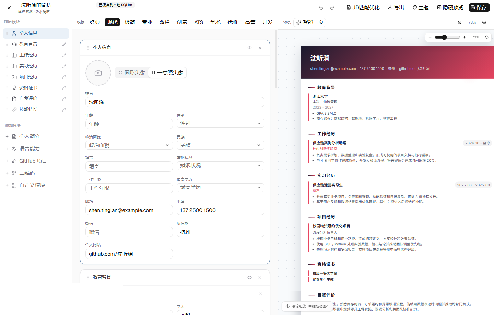 | 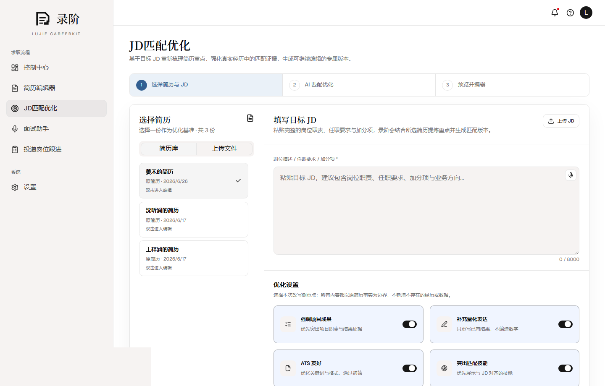 |
| **JD 匹配优化简历** | **面试助手** |
| 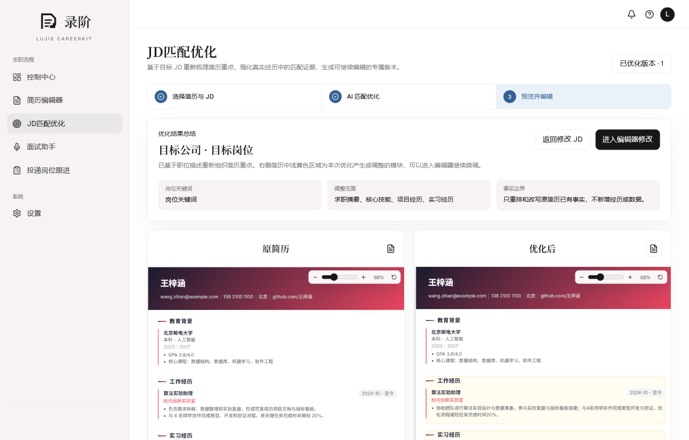 | 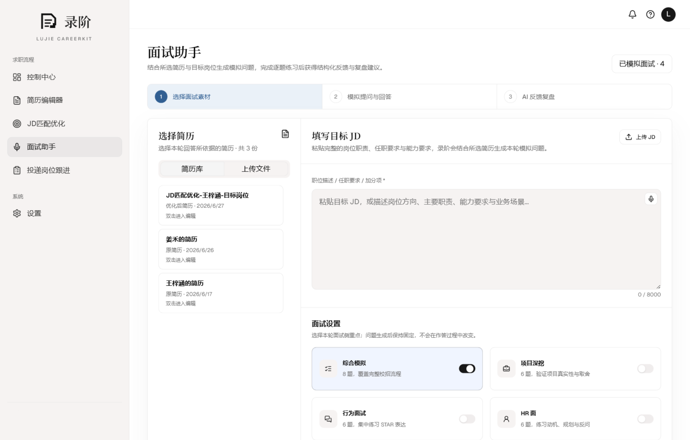 |
| **模拟面试** | **AI 复盘** |
| 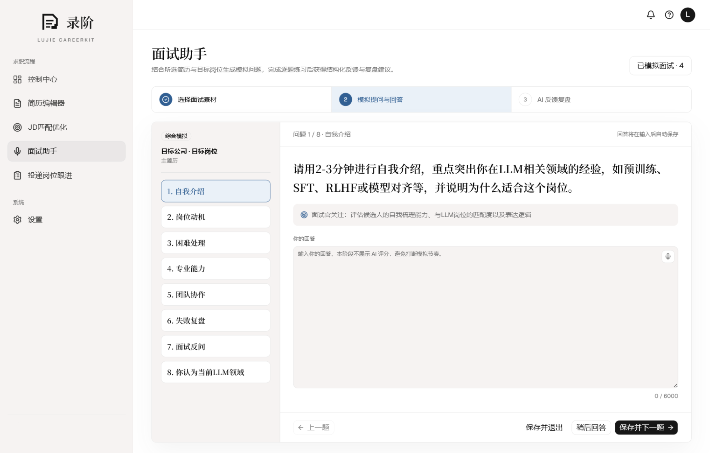 | 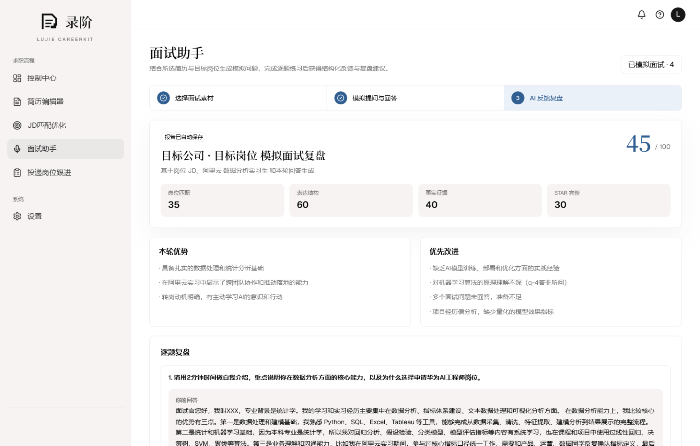 |
| **投递岗位跟进** | **投递状态** |
| 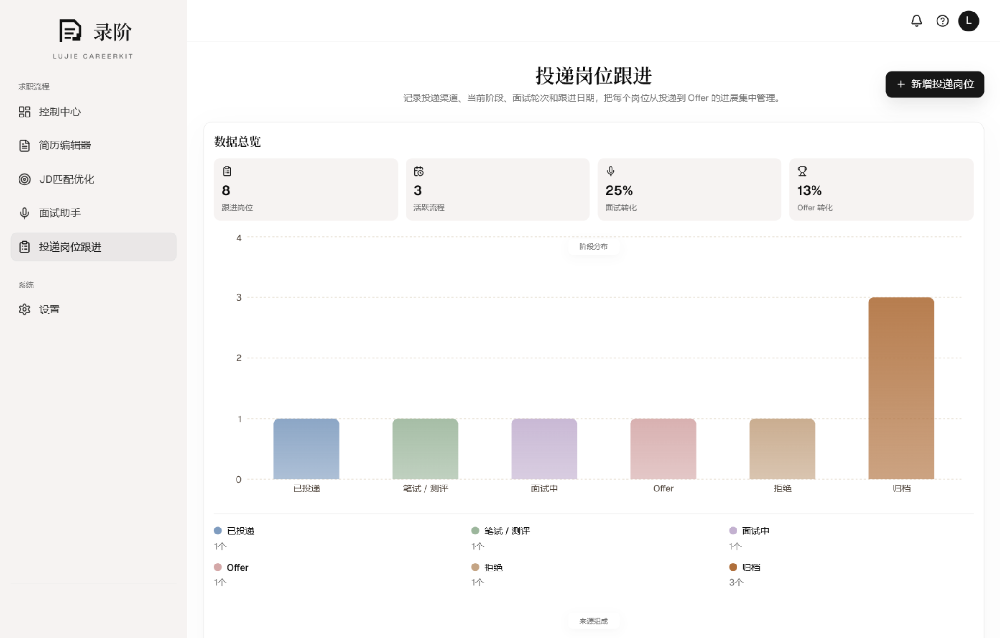 | 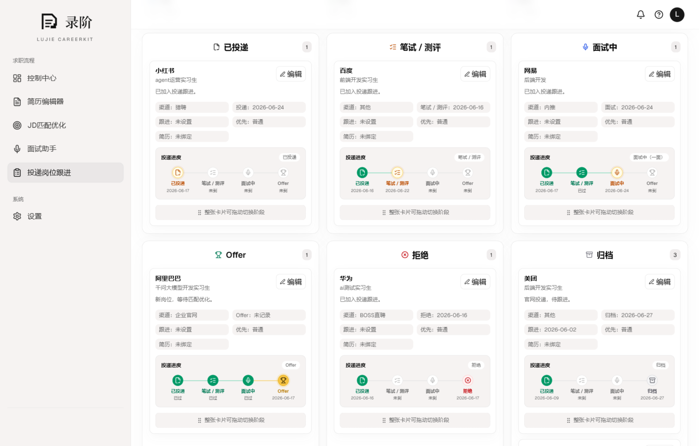 |

## 功能亮点

- **结构化简历编辑**：维护多份简历版本，可从任意简历创建独立副本进行尝试性调整；编辑教育、实习、项目、技能等模块，切换模板和主题，并导出 PDF、PNG 或可编辑 DOCX。
- **AI 优化简历**：在简历编辑器里一键生成通用优化版本，对比优化前后差异，并继续用原模板微调。
- **求职信与招呼语**：结合当前简历、完整 JD 和用户补充的到岗安排，生成适合正式投递的求职信或重点前置的招聘平台招呼语，并支持编辑、复制与重新生成。
- **JD 匹配优化**：粘贴包含公司、完整岗位名称、要求和职责的目标 JD，让 AI 在不编造经历的前提下诊断匹配点、重排重点、优化表达并保存岗位定制版本。
- **专属面试准备资料**：结合所选简历与完整 JD，生成资料概览、能力画像、证据与差距、核心知识、经历深挖、针对性问题和准备计划，并按简历长期保存。
- **投递进展管理**：记录公司、岗位、渠道、阶段、截止日期、跟进日期、备注、JD 和绑定简历版本。
- **模拟面试与复盘**：根据简历和 JD 生成面试题，保存逐题回答，并生成可回看、可继续改进的 AI 复盘报告。
- **数据与隐私可控**：简历、岗位、投递、面试资料、模拟记录和设置保存在本机 SQLite 数据库里，适合个人长期维护。

## 数据与隐私

- 简历、版本、岗位、投递、面试准备资料、模拟记录和设置保存在 `prisma/dev.db`。
- API Key 在应用内设置页配置，保存到 SQLite 前会先加密。
- `LUJIE_SETTINGS_SECRET` 是本地加密密钥，用来保护已保存的 AI Key。请在 `.env.local` 里使用足够长的随机字符串。

## 快速开始

### 环境要求

- Node.js 20.9 或更高版本
- npm
- Chrome 或 Edge：浏览器语音识别体验更完整

### Docker 部署（推荐）

```bash
docker run -d --name lujie-careerkit \
  -p 3000:3000 \
  -v lujie-data:/data \
  -e LUJIE_SETTINGS_SECRET="replace-with-a-long-random-string" \
  ghcr.io/chozzc/lujie-careerkit:latest
```

打开 [http://localhost:3000](http://localhost:3000)。SQLite 数据会保存在 Docker volume `lujie-data` 中，API Key 在应用内设置页配置。

`LUJIE_SETTINGS_SECRET` 用于加密本机保存的设置密钥，请替换成一串足够长的随机字符串。

使用 `latest` 会跟随最新的 `main` 构建；发布 v0.2.2 后，也可以把镜像标签固定为 `v0.2.2`。

### 本地开发

```bash
git clone https://github.com/Chozzc/Lujie-Careerkit.git
cd Lujie-Careerkit
npm ci
```

创建本地环境文件，并生成一个加密密钥：

```bash
cp .env.example .env.local
node -e "console.log(require('crypto').randomBytes(32).toString('hex'))"
```

Windows PowerShell：

```powershell
Copy-Item .env.example .env.local
node -e "console.log(require('crypto').randomBytes(32).toString('hex'))"
```

把生成的值写入 `.env.local` 的 `LUJIE_SETTINGS_SECRET`，然后启动应用：

```bash
npm run dev
```

打开 [http://localhost:3000](http://localhost:3000)。应用会在首次使用时创建本地数据库结构和示例数据。

## 环境变量

```env
DATABASE_URL="file:./dev.db"
LUJIE_SETTINGS_SECRET="change-me-to-a-long-random-string"
OPENAI_BASE_URL="https://dashscope.aliyuncs.com/compatible-mode/v1"
OPENAI_MODEL="qwen3.6-flash"
```

`OPENAI_BASE_URL` 和 `OPENAI_MODEL` 只用于首次默认值。真实 API Key 请在应用内设置页配置。

## AI 服务配置

1. 打开应用内设置页。
2. 选择 OpenAI-compatible 服务商。
3. 填写 Base URL、模型名称和 API Key。
4. 保存后点击测试连接。

AI 功能会在设置保存且连接测试成功后启用。

## 版本更新

### v0.2.2

#### 求职信与招呼语

- 在简历编辑器的“创建副本”和“导出”之间新增“求职信”入口，直接使用当前编辑内容与完整 JD 生成申请文本，无需先保存简历。
- 求职信适合招聘笔记私信、邮件和正式投递，强调礼貌、完整和岗位匹配；招呼语适合 Boss 直聘等即时沟通场景，优先展示到岗时间、可实习时长、每周到岗天数和核心能力证据。
- 支持补充真实的到岗安排、毕业时间和求职动机；生成结果可直接编辑、复制和重新生成，两种文本分别保留结果。

#### 真实性与隐私

- 到岗时间、实习时长和每周到岗天数只会使用用户明确填写的信息，模型不得自行推测；JD 中缺少简历证据的要求不会被写成候选人已经具备。
- AI 请求继续过滤邮箱、电话、个人链接、Logo、编辑器设置和内部优化元数据，并对输入长度与结构化输出进行校验。

### v0.2.1

#### 简历副本与版本维护

- 可从简历库或编辑器一键创建独立副本，并直接进入新副本继续编辑；原简历保持不变，新副本不会继承投递、岗位或面试关联。
- 副本完整保留简历正文、模块、模板与主题，连续复制时会自动使用“副本”“副本 2”等名称避免混淆。
- 从 AI 优化简历创建副本时保留全部优化成果，但移除内部优化快照和岗位关联，使副本成为可独立维护的普通简历版本。

#### 简历稳定性

- 修复多组技能分类在保存、重新打开或技能顺序变化后发生合并与重复的问题。

### v0.2.0

#### 面试准备闭环

- 新增可保存的专属面试准备资料：根据完整 JD 与所选简历生成资料概览、能力画像、证据与差距、核心知识、经历深挖、针对性问题和准备计划。
- 增加能力雷达图、资料目录与分区展示；生成后的资料可按简历回看，并可直接继续生成模拟面试题和复盘报告。
- 公司和岗位名称改由 AI 从完整 JD 中识别，保留岗位方向、实习 / 校招属性和括号内限定词；移除依赖 JD 首行格式的正则命名。

#### 简历与 JD 工作流

- 修复简历导入与优化中的数据完整性问题：工作、实习和项目经历分别还原，个人总结与自我评价分别保存，已删除模块不会在后续操作中被重新补回。
- AI 请求会过滤联系方式、Logo、编辑器设置和内部基准快照，减少无关内容与隐私数据进入模型上下文。

#### 数据与稳定性

- 为旧版 SQLite 数据库自动补充面试准备资料表和缺失字段，不覆盖已有简历、投递、面试与设置数据。
- 修复无效简历快照的回退处理、优化版本去重及相关工作流的数据一致性问题。
- 统一控制中心路由与项目仓库入口。

### v0.1.9

- 修复 PDF 文本提取，使支持的 PDF 可以结构化导入：配置非百炼模型后，已提取的 PDF 和 Word 文本也可由 AI 还原为可编辑简历；图片和复杂文件仍建议使用阿里百炼 API。
- 更新部分内置 Provider 与模型候选，并优化简历导入的进度与配置提示。

## 常见问题

### 1. 必须配置 API Key 才能使用吗？

不是。简历编辑、投递跟进等基础功能可以本地使用；JD 匹配、面试准备资料、模拟面试和 AI 复盘等 AI 功能需要配置 OpenAI-compatible 服务的 API Key。

### 2. 我的数据保存在哪里？

默认保存在本机的 `prisma/dev.db`。这是本地运行数据，不应该提交到 GitHub。

### 3. 控制中心的数据怎么计算？

- **投递岗位**：统计已进入投递跟进看板的岗位，不包含还未投递的 JD 匹配草稿。
- **活跃流程**：统计仍在推进中的岗位，包括已投递、笔试 / 测评、面试中。
- **到期跟进**：只统计活跃流程。优先使用手动设置的下次跟进日期；已投递且未设置下次跟进时，按投递后 7 天作为建议跟进日；笔试 / 测评和面试中使用当前阶段日期。
- **Offer**：统计已标记为 Offer 的岗位。

### 4. `LUJIE_SETTINGS_SECRET` 是什么？

它是本地加密密钥，用来加密保存到 SQLite 的 API Key。换掉这个值后，旧数据库里已经保存的 API Key 可能无法解密，需要重新在设置页保存。

### 5. 可以换成别的模型服务吗？

可以。只要服务兼容 OpenAI 接口，就可以在设置页填写对应的 Base URL、模型名称和 API Key。

## 项目结构

```text
.github/workflows/      GitHub Actions workflow，包括 GHCR 镜像发布
Dockerfile              生产容器镜像定义
docker-compose.yml      本地 Docker 启动与 SQLite 持久化卷配置
prisma/                 Prisma schema 与本地 SQLite 运行数据
src/app/                Next.js 页面与 API 路由
src/components/         工作台、简历、面试和共享 UI
src/hooks/              浏览器 Hook，例如语音识别
src/lib/                Repository、AI、导出、解析和领域逻辑
src/stores/             简历编辑器状态
src/types/              共享 TypeScript 类型声明
public/brand/           品牌标识和封面资产
public/images/          README 截图
third-party/            第三方许可证说明
```

## 致谢

简历编辑器复用并改造了 [JadeAI](https://github.com/LingyiChen-AI/JadeAI) 的部分设计思路和实现概念。JadeAI 使用 Apache License 2.0；对应许可证副本保存在 `third-party/JadeAI-LICENSE.txt`。

## 许可证

录阶使用 [Apache License 2.0](LICENSE) 开源。第三方声明见 [NOTICE](NOTICE)。
